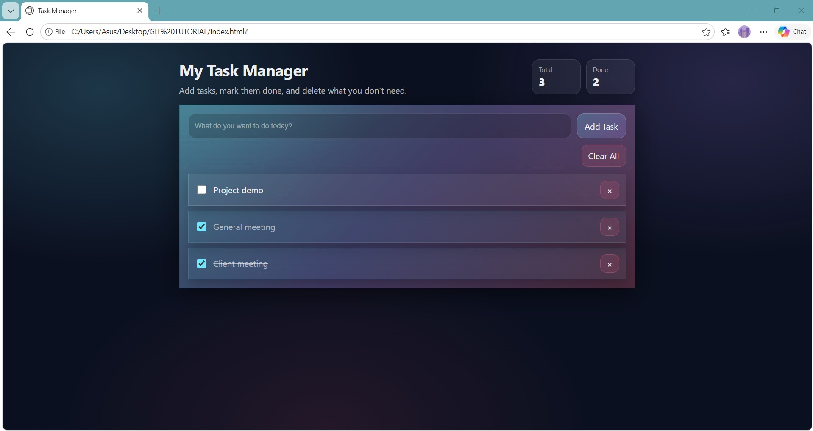
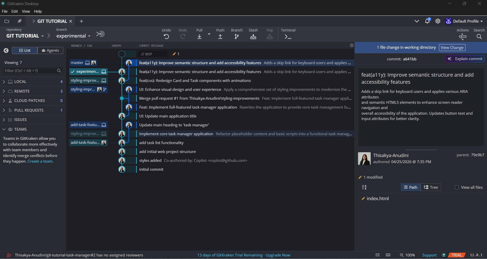
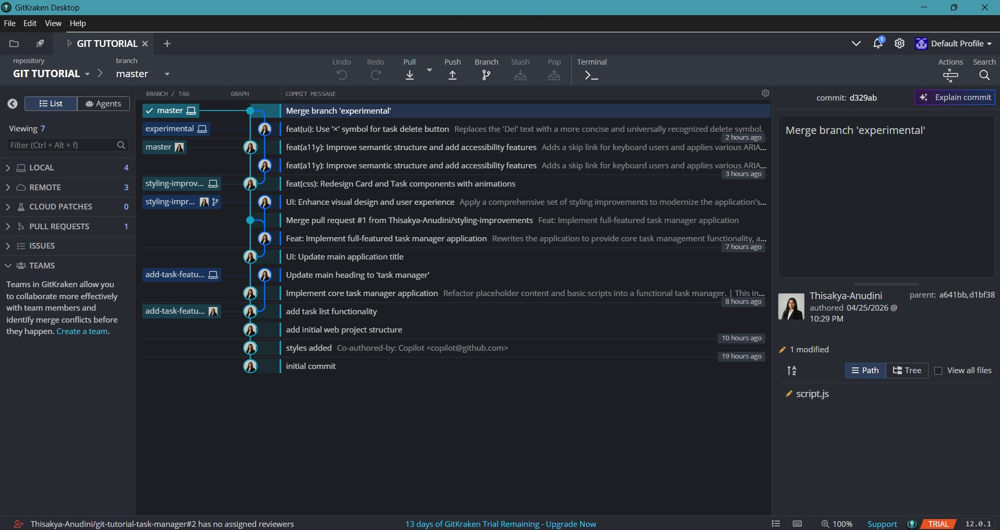
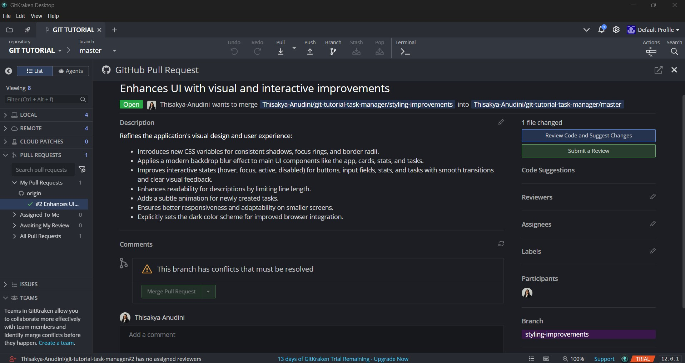

# Exploring GitKraken Desktop for Modern Git Workflows

GitKraken Desktop is a visual Git client that helps you understand history, branches and collaboration through a clean interface. This repository uses a simple **Task Manager** web app to practice Git fundamentals and GitKraken workflows such as staging, committing, branching, syncing with remotes, reviewing diffs, merging and resolving conflicts.

## Table of Contents 📚
- [Project Overview](#project-overview)
- [Screenshots](#screenshots)
- [Prerequisites](#prerequisites)
- [Run the Task Manager App](#run-the-task-manager-app)
- [Git Fundamentals (Quick Reference)](#git-fundamentals-quick-reference)
- [GitKraken Workflow (Day-to-Day)](#gitkraken-workflow-day-to-day)
- [Branching & Collaboration](#branching--collaboration)
- [Merging & Conflict Resolution](#merging--conflict-resolution)
- [Pull Requests (Concept + Typical Flow)](#pull-requests-concept--typical-flow)
- [History Cleanup (Interactive Rebase)](#history-cleanup-interactive-rebase)
- [GitKraken AI (Optional)](#gitkraken-ai-optional)

## Project Overview 🧭
- **Goal:** Learn modern Git workflows using GitKraken Desktop in a practical project.
- **App:** A small Task Manager (HTML/CSS/JS) for demonstrating changes, commits, branches, merges and collaboration.
- **Workflow focus:** Small commits, feature branches, clear commit messages and merge-based integration.

## Screenshots 🖼️
### Task Manager App

### Changes Review

### Manage Changes (Staging / Commit Preparation)

### Merge

### Pull Request

## Prerequisites ✅
- **Git** installed on your machine
- **GitKraken Desktop** installed (optional, but recommended for this workflow)

## Run the Task Manager App ▶️
- Open `index.html` in your browser.

## Git Fundamentals🧠
### Core concepts
- **Repository:** Your project plus its commit history.
- **Commit:** A snapshot of staged changes with a message.
- **Working directory:** Your current files (edited but not yet committed).
- **Staging area (Index):** Where you choose what goes into the next commit.
- **Branch:** A separate line of development (e.g., `main`, `feature/add-filter`).
- **Remote:** A hosted copy of your repository (e.g., GitHub).

### Common daily loop
1. Make a small change
2. Stage only the relevant files/lines
3. Commit with a clear message
4. Push to remote
5. Open a Pull Request (optional)
6. Merge into `main`

## GitKraken Workflow🧭
### Visual Commit Graph 🗺️
GitKraken’s visual commit graph helps you easily follow branches and merges. You can identify where a feature branch started and how it was integrated into the main branch. This makes it easier to understand merge flows without having to dive into logs.

### Diff Viewer 🔍
Before committing or merging, you can use the diff viewer to review changes line-by-line. This feature helps catch issues early, such as editing the wrong file, missing changes or accidental formatting. It's a key tool for ensuring clean commits.

### File History & Blame 🕒
With GitKraken, you can track how a file has evolved over time. The "blame" feature lets you see when and why a particular line was introduced and by which commit. This is essential for debugging and understanding the history of your codebase.

### Remote Tracking 🔄
GitKraken shows whether your branch is ahead or behind the remote. This helps you stay synchronized by reminding you to fetch or pull before starting new work and to push your commits after making changes. It reduces the risk of conflicts and keeps everyone in sync with the remote repository.

## Branching & Collaboration 🌿
### Feature Branches 🌱
Using feature branches allows you to keep the main branch clean and stable while working on new features or fixes. Each feature or bugfix is developed in its own branch (e.g., `feature/task-filter`, `fix/delete-bug`), making it easier to manage and integrate changes. This also helps with code reviews and ensures you don’t accidentally disrupt the stable main branch.

### Keeping Your Branch Up to Date with `main` 🧩
To ensure you are always working with the latest version of the project, it’s important to update your feature branch with changes from `main`. This can be done either by merging `main` into your branch or by rebasing your branch on top of `main`. Rebasing keeps the history cleaner but should be used carefully on shared branches to avoid conflicts.

## Merging & Conflict Resolution 🔀
### Merging Feature Branches into `main` 🔁
When your feature is complete, you’ll merge it into the `main` branch. GitKraken helps preview the merge before you complete it, so you can see how the history will look. You can review the changes and resolve any issues before merging.

### What Causes Merge Conflicts ⚔️
Merge conflicts occur when changes from two different branches affect the same part of the code and Git can’t automatically decide which version to keep. This often happens when multiple people are working on the same file.

### Resolving Conflicts ✅
GitKraken’s conflict resolution tools help you open the conflicted files and compare the changes from both branches. You can then decide which version to keep or even combine both changes. Once resolved, mark the conflict as fixed and complete the merge.

## Pull Requests (Concept + Typical Flow) 🧾
Pull Requests (PRs) are a review and integration workflow commonly used with platforms like GitHub, GitLab and Bitbucket.

### Typical PR Flow:
1. Create a feature branch
2. Commit small, focused changes
3. Push the branch to the remote repository
4. Open a PR to propose changes
5. Review feedback and make necessary updates
6. Merge the PR into `main`

Pull Requests help ensure that code is reviewed before it is merged, providing an opportunity for peer feedback and preventing integration issues.

## History Cleanup (Interactive Rebase) 🧼
Interactive rebase is a powerful tool for cleaning up commit history before merging into the main branch. It allows you to:
- **Squash** multiple small commits into a single, meaningful commit
- **Reword** commit messages for clarity
- **Reorder** commits to improve readability

This ensures your Git history remains clean and organized, which is especially important for collaborative projects.

> Tip: Avoid rewriting history on branches that others are already using, as this can cause confusion and integration issues.

## GitKraken AI 🤖
GitKraken AI can help with:
- **Improving commit messages:** It suggests clearer, more consistent messages to improve project documentation.
- **Summarizing changes:** The AI can provide concise summaries of commit changes, making code reviews easier.
- **Supporting cleanup:** It offers recommendations for clearer wording and structure, ensuring your Git history is easy to follow.

### Handling Mistakes:
- **If not pushed:** You can use interactive rebase or reset to fix mistakes.
- **If pushed:** It’s better to make a new commit that fixes or reverts the previous mistake.
- **Too many changes in one commit:** Next time, consider staging smaller parts of the change (e.g., by file or by hunk) and commit them in smaller, focused units.
